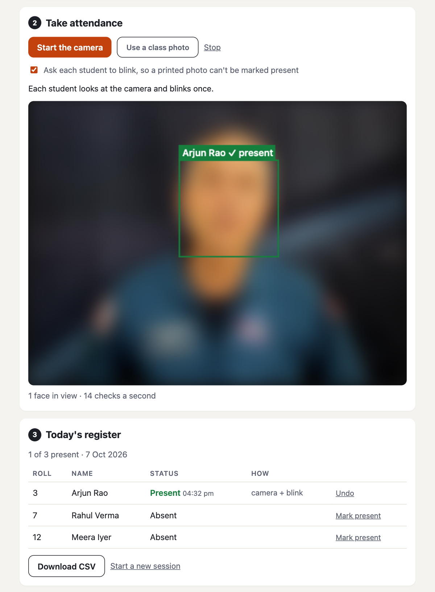

# Face recognition attendance: live demo

**Try it:** https://finalcommitprojects.github.io/demo-face-attendance/

Register students once, then mark the class present from the camera, with a blink check, or from a class photo.

This repository only hosts the live demo, so the JavaScript here is bundled and minified. The full source code, with the setup or training scripts, tests, documentation and the project report, comes with the project when you take it with [Final Commit](https://finalcommitprojects.github.io/?utm_source=github&utm_campaign=demo-face-attendance).

Uses face-api (MIT) and MediaPipe Face Landmarker (Apache 2.0), loaded from jsDelivr. The camera image in the screenshot is blurred and the names are made up.

© 2026 Final Commit. All rights reserved.
